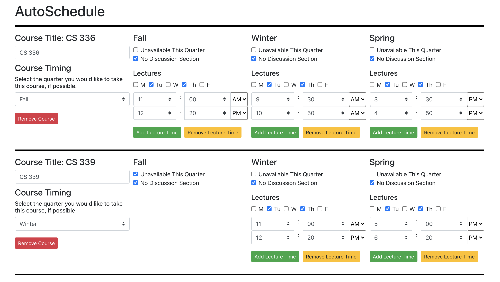
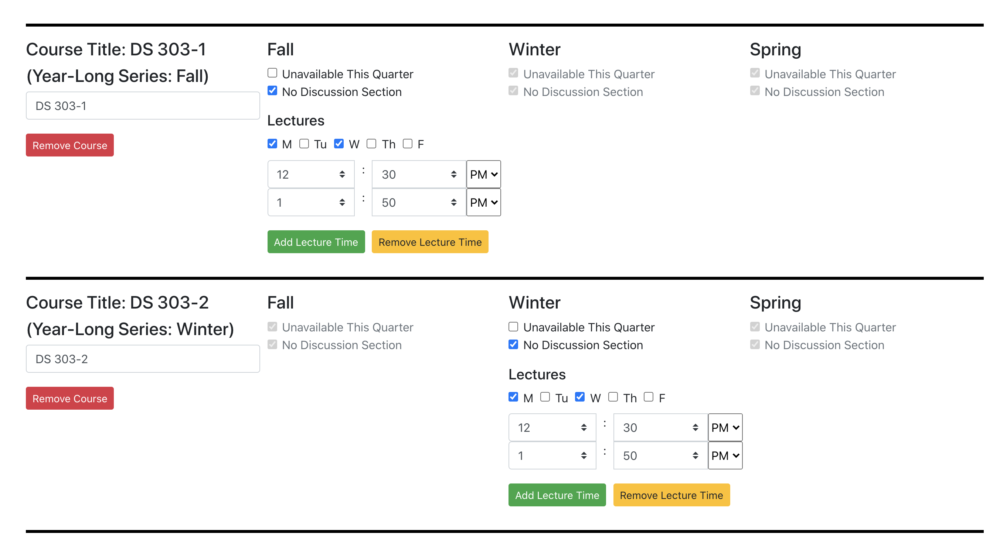
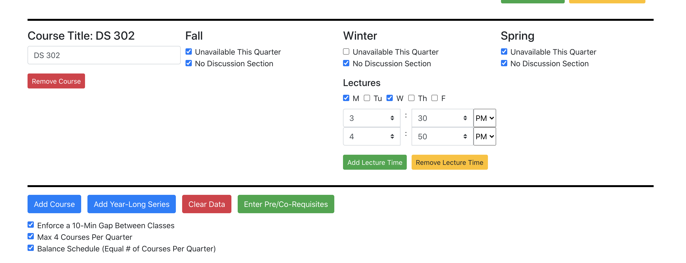
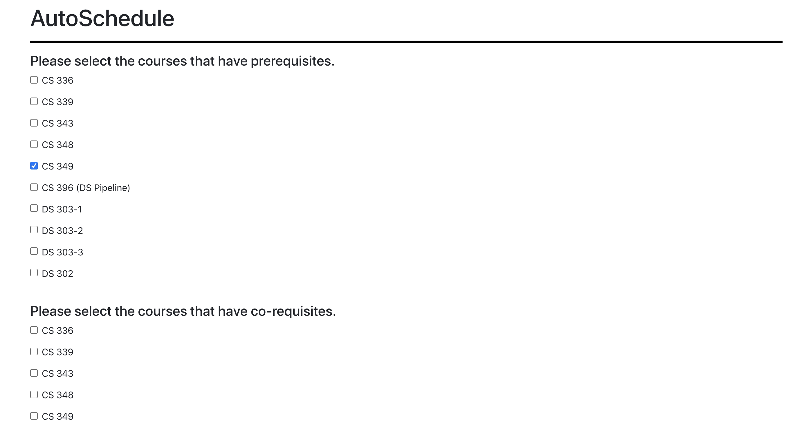
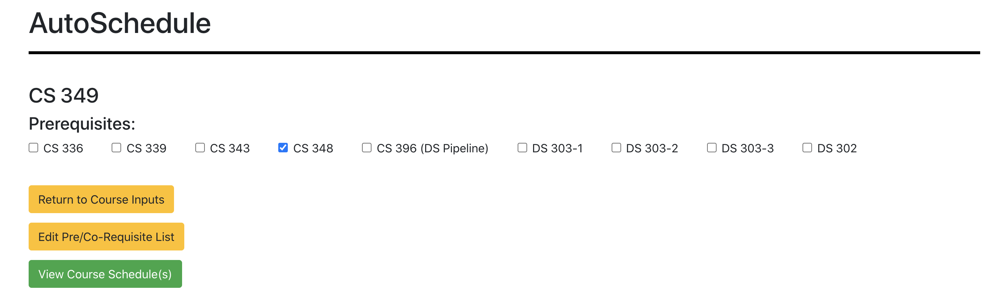
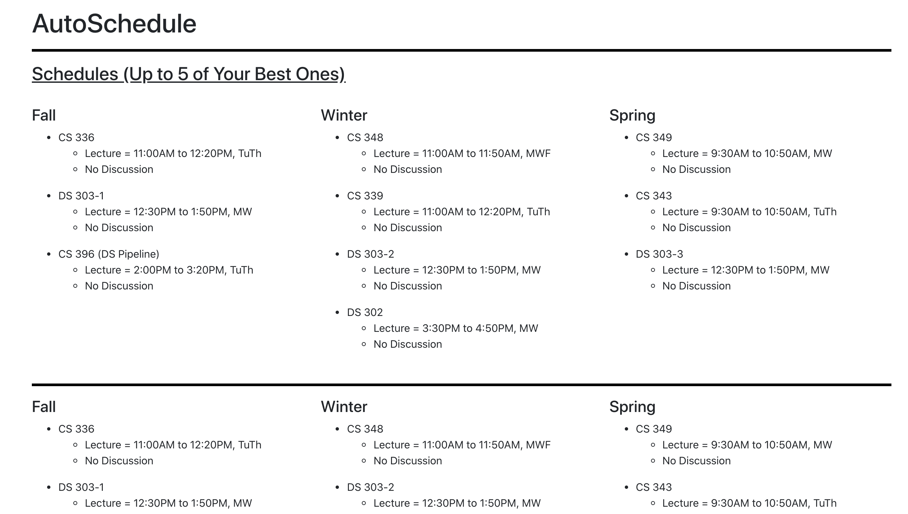
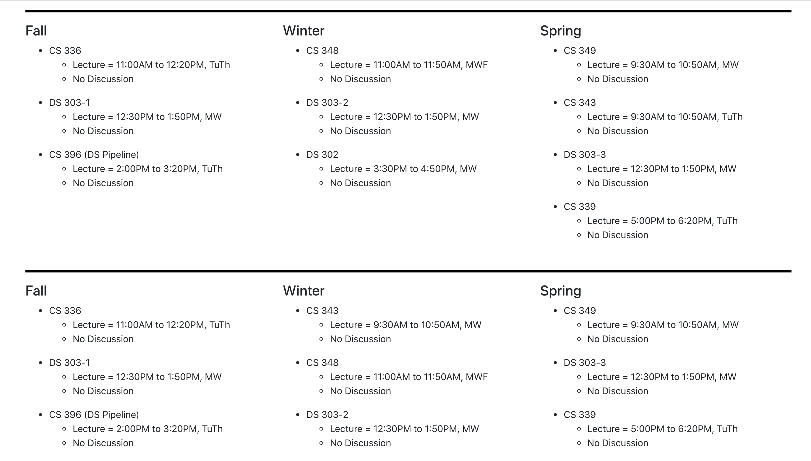

# AutoSchedule

## Description
AutoSchedule is React application that allows college students (specifically those on the quarter system) to determine their schedules for an academic year without the hassle of trying to meticulously determine when courses are available, when they overlap, if they have any pre-requisites to meet, etc. 

Using AutoSchedule, students can 

   * Enter their courses for the upcoming year, along with what quarters and times the courses are available
   * Mark their preferences for when they would like to take each course (fall/winter/spring)
   * Indicate any pre/co-requisites amongst the entered courses (e.g. I entered CS 348 & CS 349, but one is a pre-req for the other)

and then automatically have the application generate a list of suggested schedule(s) for them. 

## UI Demonstration

### Enter Course Inputs

#### Standard Course Inputs

#### Year-Long Course Series

#### Other Parameters

--------------------------------
### Prerequisites/Co-requisites

--------------------------------
### View Course Schedules

